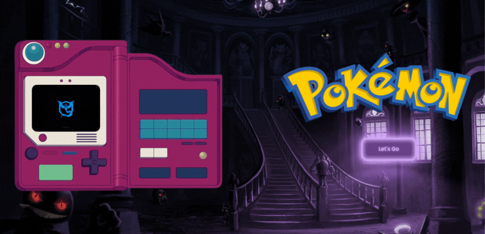

## **¡¡Hello World...!!**

```text
It is a pleasure to greet you. Let me tell you a little about myself.
Throughout my professional career, life has given me the opportunity
to explore different paths, but what I am passionate about is the world
of programming. Currently, I work on freelance projects to maintain
and improve my technical skills, and through this repository,
I share my progress in this exciting journey of programming.

Thank you for visiting my profile. Here you will find a variety of projects
I have worked on, each representing a step towards perfecting my skills
as a programmer. Feel free to explore my projects and get in touch if
you have any questions or suggestions. I hope you find inspiration or
usefulness in my work for your own journey in the world of programming.
```


```javascript
const emmanuel = {
  pronouns: "he" || "him",
  aboutMe: ["web dev", "tech"],
  technologies: {
    frontEnd: [
      "JavaScript",
      "HTML",
      "React",
      "Redux",
      "CSS",
      "Style Component",
    ],
    backEnd: ["nodeJS", "express", "sequelize"],
    dataBase: ["postgreSQL"],
    tools: ["git", "gitHub", "vsCode", "Slack", "figma"],
    methodologies: ["Scrum", "5S", "Prototipado"],
    operatingSystem: ["Windows", "KaliLinux","MacOS"],
    otherLanguages: [" python "],
  },
};
```

```
More about me 👨‍💻--> Outside of programming, something interesting to say is that
I have played soccer since my childhood and it is a taste that I still have,
I also adopted a taste for carpentry, creating and giving physical shape to something
you imagine is very satisfying for me. Socially, I like to spend time with
my loved ones, whether traveling, eating, or watching a movie.
```

### Projects

| **project-pokemon**                                 | [WebSite](https://project-pokemon-psi.vercel.app/)                                                                                                                                                                                                                                                                                                                                                                                                                                                                                                                                                                                      |
| --------------------------------------------------- | ------------------------------------------------------------------------------------------------------------------------------------------------------------------------------------------------------------------------------------------------------------------------------------------------------------------------------------------------------------------------------------------------------------------------------------------------------------------------------------------------------------------------------------------------------------------------------------------------ |
|  | The general idea was to create an application where you can see different pokemons by consulting an external API and from there you can: Search, Filter, order, and create new Pokemons. [More details of the project.](https://github.com/EmmanuelArenas/project-pokemon) **Acquired knowledge ->** Program routes, filters, validations, promises, pagination, state management, modularization, connecting the database with the backend and the backend with the frontend. **Technologies ->** _javascript_, _html_, _react_, _redux_, _css_, _nodejs_, _express_, _sequelize_, _postgresql_ |

----

<!--  -->

### **Certifications**
 [JavaScript Algorithms and Data Structures](https://www.freecodecamp.org/EmmanuelRobson) | [Responsive Web Design](https://www.freecodecamp.org/EmmanuelRobson)

### **Connect with me!**

[](https://www.linkedin.com/in/emmanuelarenas-front-end-developer) [](https://www.instagram.com/emmanuel_r0bson/) [](https://twitter.com/EmmanuelR0bson)

